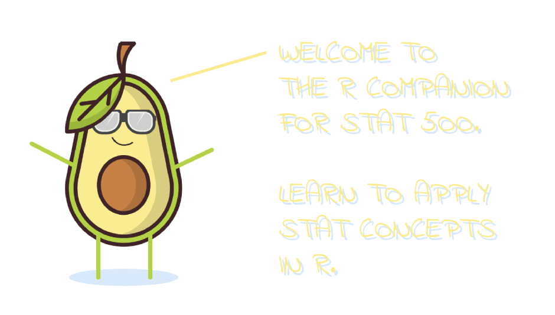
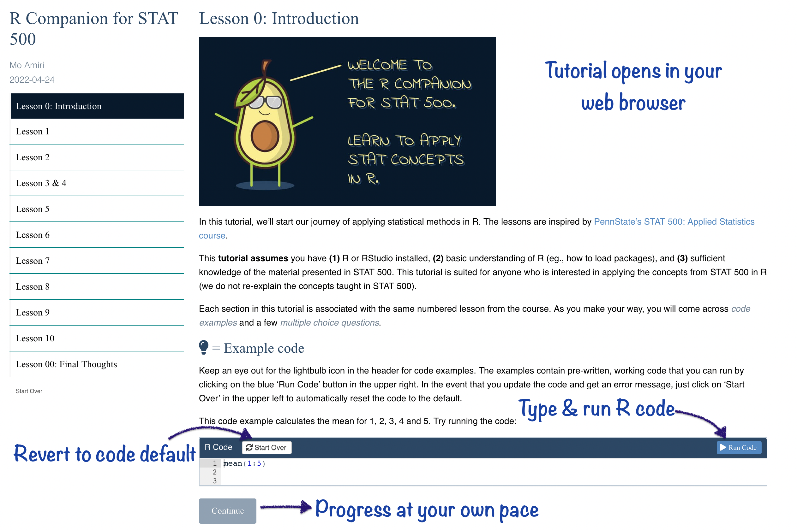
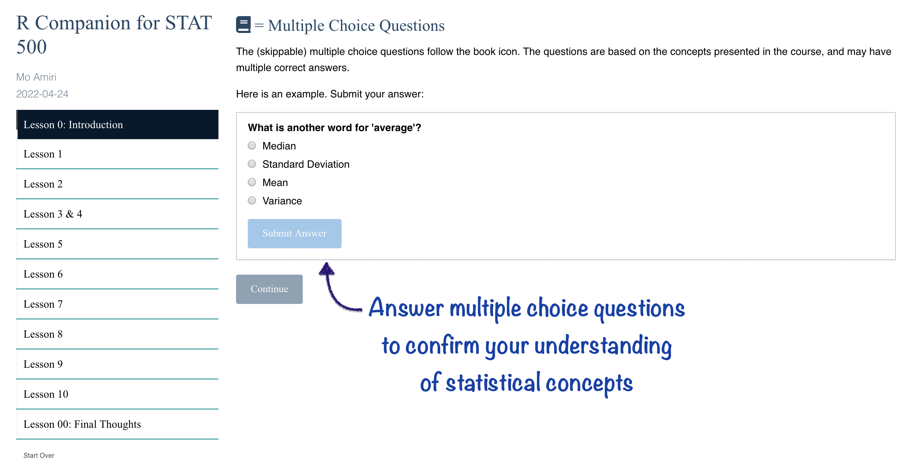
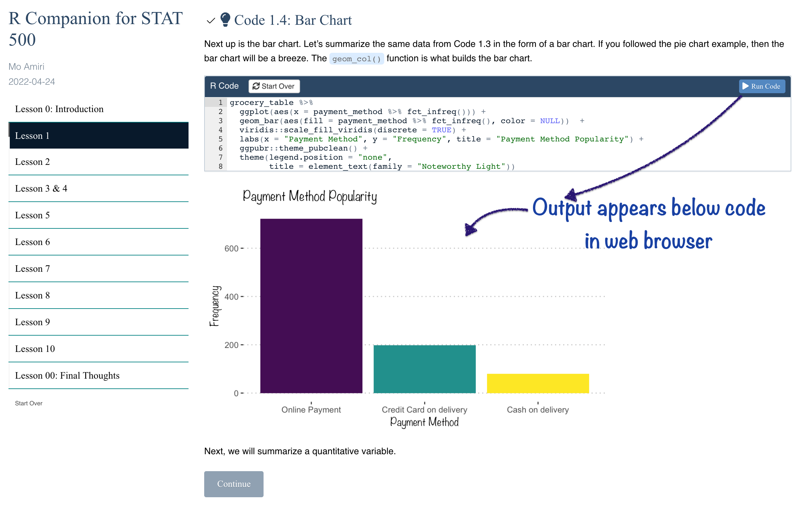
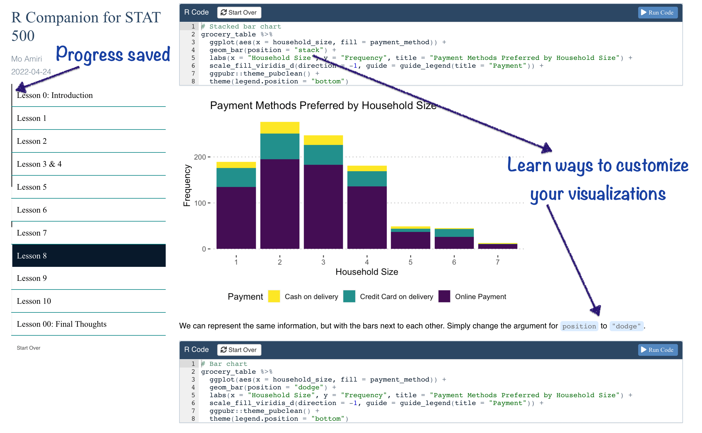
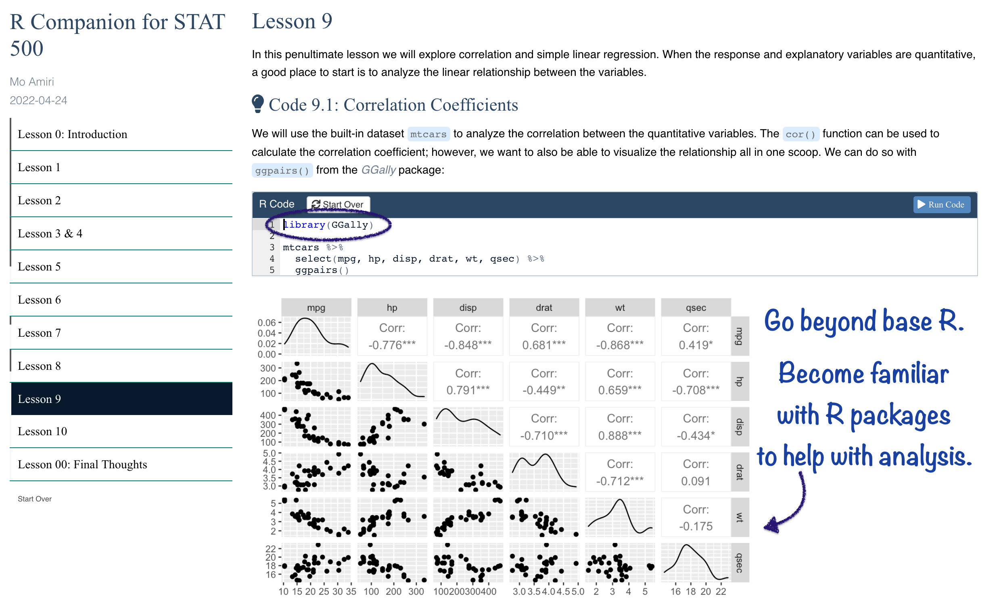
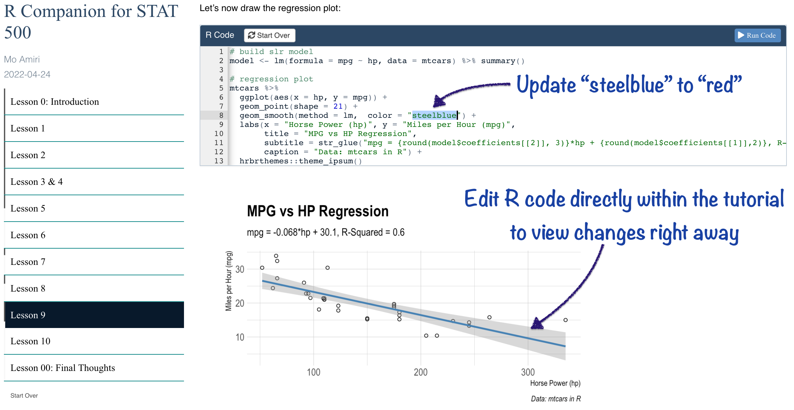
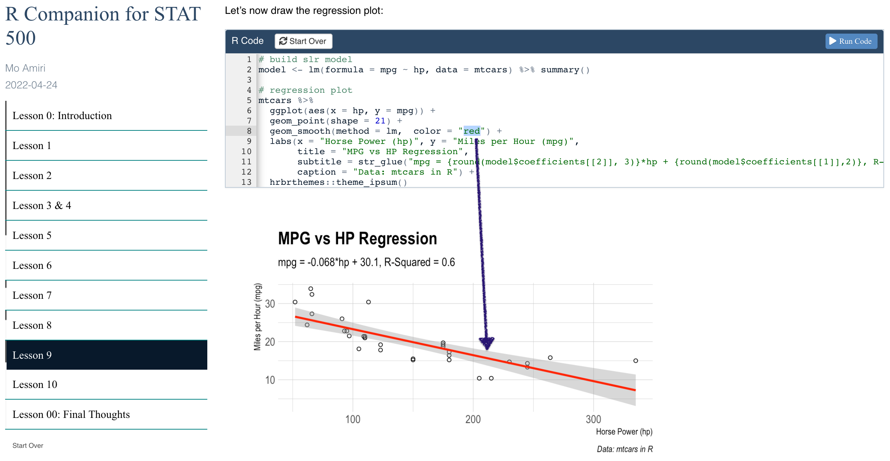
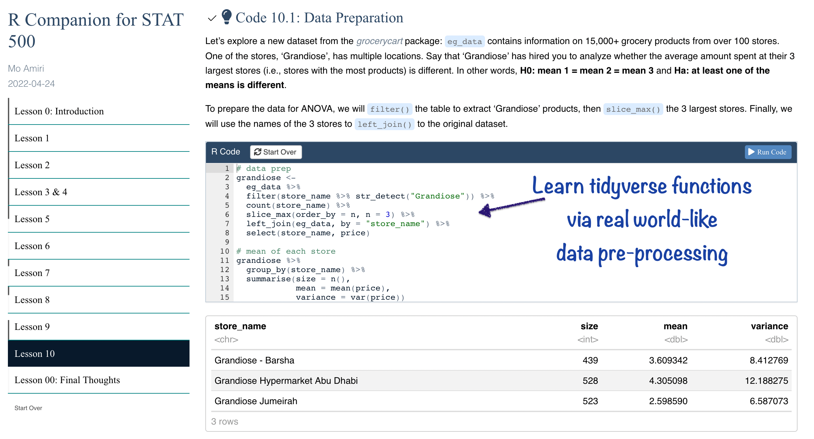
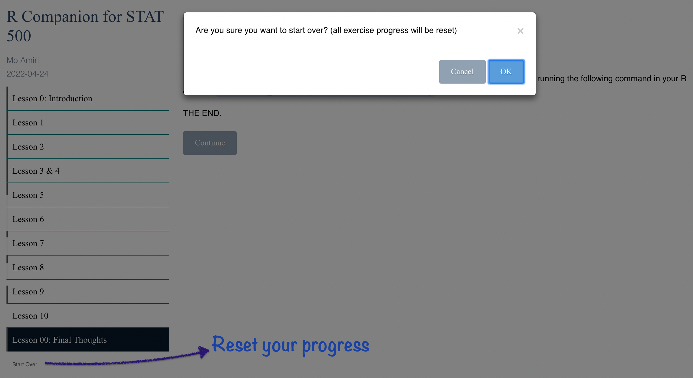

# stat500r 

With the **stat500r** package you can run an interactive R tutorial, in your web browser locally, that
teaches how to use R to apply the concepts taught in
a typical statistics course. In particular, the tutorial is meant to be
accompanied by [Penn State’s STAT 500 course](https://online.stat.psu.edu/stat500/) (ps. this tutorial is not affiliated with
Penn State University).

The topics covered include, but are not limited to: 
- Visualizing quantitative and qualitative data using **ggplot2**.  
- Constructing **t-tests, Chi-Square hypothesis tests, Simple Linear Regression and ANOVA models**.  
- Calculating **confidence intervals**.  
- Building **probability tree diagrams**.  
- Exploring the **tidyverse**.  
- And more…  

## Run Tutorial
**A live version of the tutorial can be run by typing the following commands in your R console** (it opens the tutorial locally on your computer in a new tab in your default web browser):  
```
# needed to install the stat500r package (run only once)
install.packages("remotes")

# install stat500r package from github (run only once)
remotes::install_github("moamiristat/stat500r")

# run tutorial (run whenever you want to start up the tutorial)
learnr::run_tutorial("Introduction", "stat500r")
```

## Tutorial Screenshots
















## Packages Used

The tutorial was put together using the `learnr` package. All other packages contributed to the analysis portion of the tutorial.

- [learnr](https://rstudio.github.io/learnr/articles/learnr.html)  
- [tidyverse](https://tidyverse.tidyverse.org/index.html)  
- [grocerycart](https://github.com/moamiristat/grocerycart)  
- [DiagrammeR](https://github.com/rich-iannone/DiagrammeR)  
- [car](https://cran.rstudio.com/web/packages/car/index.html)  
- [correlation](https://www.rdocumentation.org/packages/correlation/versions/0.8.0)  
- [corrplot](https://cran.r-project.org/web/packages/corrplot/vignettes/corrplot-intro.html)  
- [crayon](https://github.com/r-lib/crayon)  
- [fontawesome](https://rstudio.github.io/fontawesome/index.html)  
- [GGally](https://ggobi.github.io/ggally/)  
- [ggbeeswarm](https://github.com/eclarke/ggbeeswarm)  
- [ggfortify](https://rpubs.com/sinhrks/plot_lm)  
- [ggmosaic](https://haleyjeppson.github.io/ggmosaic/)  
- [ggpubr](https://rpkgs.datanovia.com/ggpubr/)  
- [ggside](https://github.com/jtlandis/ggside)  
- [ggstatsplot](https://indrajeetpatil.github.io/ggstatsplot/)  
- [ggthemes](https://yutannihilation.github.io/allYourFigureAreBelongToUs/ggthemes/)  
- [ggVennDiagram](https://github.com/gaospecial/ggVennDiagram)  
- [Hmisc](https://hbiostat.org/R/Hmisc/  )
- [hrbrthemes](https://hrbrmstr.github.io/hrbrthemes/)  
- [remotes](https://remotes.r-lib.org)  
- [ridgeline](https://cran.r-project.org/web/packages/ggridges/vignettes/introduction.html)  
- [Rmisc](https://github.com/RyanHope/Rmisc)  
- [scales](https://scales.r-lib.org)  
- [viridis](https://cran.r-project.org/web/packages/viridis/index.html)
