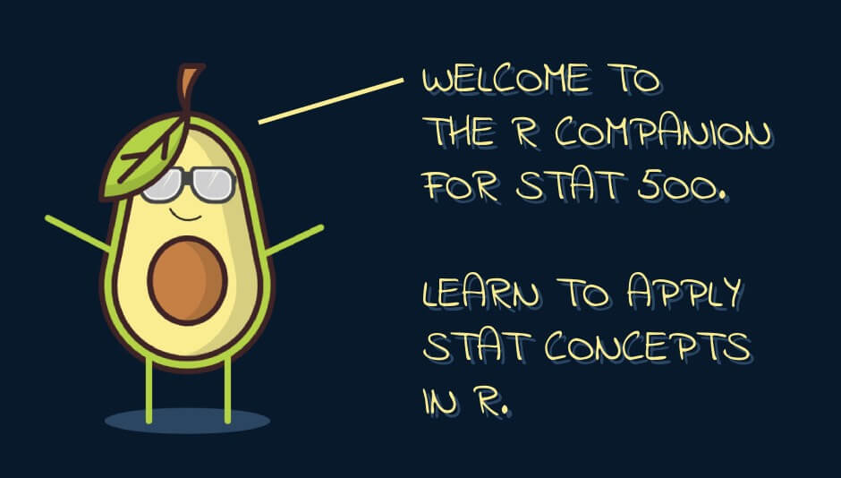

```{r setup, include=FALSE}
# Attach packages
library(learnr)
library(tidyverse)
library(grocerycart)
library(fontawesome)
library(ggVennDiagram)
library(DiagrammeR)

# Prepare data to be used
data("grocery_data", package = "grocerycart")

set.seed(500)
grocery_table <- 
  grocery_data %>% 
  slice_sample(n = 1000) %>% 
  select(-order_time, -long, -lat, -store) %>% 
  mutate(across(.cols = c(household_size, payment_method), ~ as.factor(.))) %>% 
  mutate(customer_age = as.integer(customer_age)) %>% 
  relocate(customer_id, customer_name, customer_age, household_size, order_date, payment_method, 
           .before = cost)

grocery_table %>% 
  group_by(household_size) %>% 
  summarise(mean(cost), sd(cost), n())

# Global code chunk options
knitr::opts_chunk$set(echo = FALSE, message = FALSE)

```

## Lesson 0: Introduction

```{r main-fig, echo = FALSE,  out.height = "50%"}

```

In this tutorial, we'll start our journey of applying statistical methods in R. The lessons
are inspired by [PennState's STAT 500: Applied Statistics course](https://online.stat.psu.edu/stat500/). 

This **tutorial assumes** you have **(1)** R or RStudio installed, **(2)** basic understanding of R (eg., how to load packages), and **(3)** sufficient knowledge of the material presented in STAT 500. This tutorial is suited for anyone who is interested in applying the concepts from STAT 500 in R (we do not re-explain the concepts taught in STAT 500).

Each section in this tutorial is associated with the same numbered lesson from the course. As you make your way, you will come across *code examples* and a few *multiple choice questions*. 

### `r fa("fas fa-lightbulb")` = Example code

Keep an eye out for the lightbulb icon in the header for code examples. The examples contain pre-written, working code 
that you can run by clicking on the blue 'Run Code' button in the upper right. In the event that you update the code and get an error message, just click on ‘Start Over’ in the upper left to automatically reset the code to the default.

This code example calculates the mean for 1, 2, 3, 4 and 5. Try running the code:

```{r code-example, exercise = TRUE, exercise.eval = FALSE, exercise.startover = TRUE}
mean(1:5)
```

### `r fa("fas fa-book")` = Multiple Choice Questions

The (skippable) multiple choice questions follow the book icon. The questions are based on the concepts presented in the course, and may have multiple correct answers.

Here is an example. Submit your answer:

```{r mcq-example, echo = FALSE}
question("What is another word for 'average'?",
  answer("Median"),
  answer("Standard Deviation"),
  answer("Mean", correct = TRUE, message = "You got the hang of it!"),
  answer("Variance")
)
```

### Meet the data
We will be working with grocery data for the entirety of this tutorial, so it's a good
idea to get familiar with it. Here's what you need to know for now:

**Data source:** The data is a part of an R package I built for scraping 2 online grocery websites. It was simulated with the help of other R packages. Note that the variables are NOT based on true/'real-life' people/orders. If interested, you can learn more about the [grocerycart package on Github](https://github.com/moamiristat/grocerycart).

**Variables:**

- `basket_id`: basket id
- `order_id`: order id
- `customer_id`: customer id
- `customer_name`: random first and last name
- `customer_age`: random age from 18 to 75
- `household_size`: random number of people (1 to 7) living with customer, including customer
- `order_date`: day, month and year of order
- `payment_method`: 1 of 3 methods used to pay for the order
- `cost`: total price of an order

**Data table:** The data is already in tidy/clean format so we can jump right into analyzing it. Here is a preview of the first 10 rows:

```{r grocery-data, echo = FALSE}
grocery_data %>% 
  slice_head(n = 10)
```

We are finally ready to start with Lesson 1 and explore the data in R! 


## Lesson 1

For our first lesson, we'll learn about several R functions to summarize data and start getting familiar with the tidyverse.

### `r fa("fas fa-lightbulb")` Code 1.1: Sample

Let's take a sample of 5 customer names without replacement from our grocery data frame. We can do so using [`sample()`](https://www.rdocumentation.org/packages/base/versions/3.6.2/topics/sample). Press 'Run Code' to sample.

\**Note: To get a reproducible outcome (the same outcome every time you run the code), simply use the `set.seed()` function before sampling. `set.seed()` somewhat controls for the random part of the sampling.*

```{r sample, exercise = TRUE, exercise.eval = FALSE, exercise.startover = TRUE}
# set.seed(123)
sample(x = grocery_table$customer_name, size = 5, replace = FALSE)
```

The next 3 code sections visualize 1 qualitative variable via a proportion (contingency) table, pie chart and bar chart.

### `r fa("fas fa-lightbulb")` Code 1.2: Proportion Table

The proportion table is a simple way to see the frequency distribution of variables. Let's check the breakdown of orders by household size. Run the code below to see that 18.90% of the orders were placed by customers who lived alone.

```{r prop-table-base, exercise = TRUE, exercise.eval = FALSE, exercise.startover = TRUE}
prop.table(table(grocery_table$household_size))
```

As you get more familiar with R, you will realize that there's many different ways to do the same thing. Let's find the frequency distribution of orders by household size using `dplyr` (part of the **tidyverse**) and make the output more pretty.

An important **advantage of coding using the tidyverse is an improvement in code readability**. The **pipe operator** ` %>% ` is a convenient way to pass intermediate results onto the next function. For example you can re-write the same code above as `grocery_table$household_size %>% table() %>% prop.table`. Notice that the code is now read from 'inside' to 'outside', so it follows a natural call to functions. You can decide for yourself which one is easier to make sense of. Ok, back to our example:

```{r prop-table-dplyr, exercise = TRUE, exercise.eval = FALSE, exercise.startover = TRUE}
grocery_table %>% 
  count(household_size, name = "freq") %>% 
  mutate(prop = scales::percent(freq / sum(freq)))
```

\**Note: To learn more about what each function does, use `?`. For example, run `?mutate` in your R/RStudio environment.*

### `r fa("fas fa-lightbulb")` Code 1.3: Pie Chart

While there is a quick way to create a pie chart with the `pie()` function, we will dive into another part of the tidyverse: **ggplot2** is the premier data visualization package in R.

It follows a simple idea of building visualization layers on top of each other with the `+` operator as you will see below. This means that the order in which you add the functions/layers matter when building plots using **ggplot2**.

Before building our pie chart, we will need to do some data prep. First, we will count the absolute (#) and relative (%) frequency of each payment method. Then, build the pie chart for the payment methods.

Notice the assignment ` <- ` operator. It is used to save (aka, assign) the results of some piece of code to some variable. Let's see everything in action below. Remember that you do not need to memorize the functions. Whenever you need help, just type `?*function name*` to remind yourself of the functions.

- `ggplot()`: Initializes a ggplot object
- `geom_col()`: Builds bar charts
- `coord_polar()`: Transforms the coordinates to polar
- `geom_text()`: Adds labels to plots
- `str_glue()`: Formats strings/text 
- `theme_void()`: Removes theme features
- `scale_fill_brewer()`: Customizes plot colors
- `theme()`: Adjusts theme

```{r pie-chart, exercise = TRUE, exercise.eval = FALSE, exercise.startover = TRUE}
grocery_pie <- 
  grocery_table %>% 
  count(payment_method, name = "freq") %>% 
  mutate(prop = scales::percent(freq / sum(freq)))

grocery_pie %>% 
  ggplot(aes(x = "", y = freq, fill = payment_method)) + 
  geom_col() + 
  coord_polar(theta = "y", direction = -1) + 
  geom_text(aes(label = str_glue("{str_wrap(payment_method, 5)}\n{prop}")),  
            position = position_stack(vjust = .5)) + 
  theme_void() + 
  scale_fill_brewer() + 
  theme(legend.position = "none")
```

Remeber how **ggplot2** builds visualization layers on top of each other? In the example above, move `theme_void()` to the end and notice how the plot updates. Keep in mind that you do not need to memorize in what order to write the functions; with more practice you'll have a better understanding of what each layer does.

### `r fa("fas fa-lightbulb")` Code 1.4: Bar Chart

Next up is the bar chart. Let's summarize the same data from Code 1.3 in the form of a bar chart. If you followed the pie chart example, then the bar chart will be a breeze. The `geom_col()` function is what builds the bar chart.

```{r bar-chart, exercise = TRUE, exercise.eval = FALSE, exercise.startover = TRUE}
grocery_table %>% 
  ggplot(aes(x = payment_method %>% fct_infreq())) + 
  geom_bar(aes(fill = payment_method %>% fct_infreq(), color = NULL))  + 
  viridis::scale_fill_viridis(discrete = TRUE) + 
  labs(x = "Payment Method", y = "Frequency", title = "Payment Method Popularity") + 
  ggpubr::theme_pubclean() + 
  theme(legend.position = "none", 
        title = element_text(family = "Noteworthy Light"))
```

Next, we will summarize a quantitative variable.

### `r fa("fas fa-lightbulb")` Code 1.5: Central Tendency

To find the mean and median in R is super easy, simply use `mean()` and `median()`. Meanwhile, base R does not have a function for mode, so we will need to create our own function to compute mode. This will be worth seeing if you've never defined a function before.

Let's practice using `dplyr()` with the ` %>% ` operator by computing the measures of central tendency for the *cost* variable. First we define our mode function.

Before we even go there, do you know what a *function* is? It has a similar meaning to functions in Mathematics. You input some values into the arguments (think of them as variables), then the function produces an output. That's it.

The `function()` command lets R know that you are about to define a function. The arguments/inputs of the function are inserted between the `()`. Finally, the body of the function goes inside the curly brackets `{}`. An example will make things clear. Let's start by building a basic sum function, then our mode function.

```{r addition-function, exercise = TRUE, exercise.eval = FALSE, exercise.startover = TRUE}
addition <- function(first_num, second_num) {
  results <- first_num + second_num
  
  paste0("The result of ", first_num, " + ", second_num, " = ", results)
}

addition(first_num = 1, second_num = 3)
```

We called our function *addition* and will need to type it followed by *()* every time we want to invoke it. The arguments first_num and second_num are the variables where we include our inputs. Check out this blogpost for more on defining functions in R.

Now, let's define our mode function. Alternatively, you can use the `Mode()` function in the `DescTools` package. Then, we will summarise the *cost* variable.

```{r central-tendency, exercise = TRUE, exercise.eval = FALSE, exercise.startover = TRUE}
stat_mode <- function(x) {
  x %>% 
    unique() %>% 
    .[which.max(tabulate(match(x, .)))]
}

grocery_table %>% 
  summarise(average = mean(cost), 
            middle = median(cost), 
            most_freq = stat_mode(cost))
```

### `r fa("fas fa-lightbulb")` Code 1.6: Position

To find any percentile, simply use the `quantile()` function. Let's find the 20, 25, 50, 75 and 99th percentile of the *cost* variable. Notice that the 50th percentile = median from Code 1.5.

```{r quantiles, exercise = TRUE, exercise.eval = FALSE, exercise.startover = TRUE}
quantile(grocery_table$cost, probs = c(.2, .25, .5, .75, .99))
```

### `r fa("fas fa-lightbulb")` Code 1.7: 5 Number Summary

The easiest way to find the 5 number summary of a quantitative variable is to use the `summary()` function.

```{r num-summary, exercise = TRUE, exercise.eval = FALSE, exercise.startover = TRUE}
summary(grocery_table$cost)
```

### `r fa("fas fa-lightbulb")` Code 1.8: Dotplot

Let's create a dotplot using **ggplot2**. Let's take this chance to learn another useful function `filter()`. We will use to draw a dotplot to show the distribution of customer age for households of size 3.

```{r dotplot, exercise = TRUE, exercise.eval = FALSE, exercise.startover = TRUE}
grocery_table %>% 
  filter(household_size == 3) %>% 
  ggplot(aes(x = customer_age)) + 
  geom_dotplot(dotsize = .35, stackratio = 1.1, col = "salmon", fill = "salmon") + 
  scale_y_continuous(NULL, breaks = NULL) + 
  scale_x_continuous(name = "Customer Age", breaks = seq(18, 75, 10)) + 
  ggpubr::theme_cleveland()
```

### `r fa("fas fa-lightbulb")` Code 1.9: Stem & Leaf Plot

Let's create a stem and leaf plot using base R since there is not much custimization that we can do with this plot.

```{r stem-leaf-plot, exercise = TRUE, exercise.eval = FALSE, exercise.startover = TRUE}
stem(grocery_table$customer_age)
```

### `r fa("fas fa-lightbulb")` Code 1.10: Histogram

You can use `geom_histogram()` or `geom_density()` to display the distribution of a continuous variable using **ggplot2**. We'll use both for the *cost* variable, and also learn how to combine ggplot objects together with `ggarrange()`.

```{r histogram, exercise = TRUE, exercise.eval = FALSE, exercise.startover = TRUE}
p1 <- grocery_table %>% 
  ggplot(aes(x = cost)) + 
  geom_histogram(col = "lightblue", fill = "steelblue", alpha = .65) + 
  ggpubr::theme_pubclean()

p2 <- grocery_table %>% 
  ggplot(aes(x = cost)) + 
  geom_density(col = "lightblue", fill = "steelblue", alpha = .65) + 
  ggpubr::theme_pubclean()

ggpubr::ggarrange(p1, p2)
```

### `r fa("fas fa-lightbulb")` Code 1.11: Boxplot

For our 2 final plots in this lesson, we will create 2 boxplots for **(1)** the *cost* variable, and **(2)** *cost* grouped by *payment method*.

Here's the code for (1): you can skip/remove everyhting after `geom_boxplot()` if you just want to see a basic boxplot.

```{r boxplot-one, exercise = TRUE, exercise.eval = FALSE, exercise.startover = TRUE}
grocery_table %>% 
  ggplot(aes(y = cost), col = "#664EAB") + 
  geom_boxplot() + 
  labs(y = "Price") + 
  geom_text(aes(label = "Median"), y = median(grocery_table$cost) + 5, x = -.3) + 
  geom_text(aes(label = "Q1"), y = quantile(grocery_table$cost, probs = .25) + 5, x = -.3) + 
  geom_text(aes(label = "Q3"), y = quantile(grocery_table$cost, probs = .75) + 5, x = -.3) + 
  hrbrthemes::theme_ipsum(grid = "Y") + 
  scale_x_continuous(breaks = NULL)
```

Now, let's see if there's a difference in the distribution of cost across the payment methods. `facet_wrap()` separates the boxplot above into 3 different graphs, 1 for each payment method. A quick look at the boxplots shows that customer spending behaviour has a similar distribution for each payment method.

```{r boxplot-two, exercise = TRUE, exercise.eval = FALSE, exercise.startover = TRUE}
grocery_table %>% 
  ggplot(aes(y = cost, col = payment_method)) + 
  geom_boxplot(fill = NA) + 
  facet_wrap(~ payment_method) + 
  viridis::scale_color_viridis(discrete = TRUE) + 
  labs(y = "Price") + 
  scale_x_continuous(breaks = NULL) + 
  theme(legend.position = "none")
```

## Lesson 2

This is a short section. We will cover Venn diagrams and probability network/tree graphs.

### `r fa("fas fa-lightbulb")` Code 2.1: Ice Cream Data

Think of a *list* object as the general form of a data table. All you need to know for now is that the elements in the *list* do not have to be the same length (vs the columns in a table).

We will create a *list* to track what flavors were bought across 3 days at an ice cream shop. Assume that each flavor can be bought only once a day (sample without replacement), all the flavors are restocked at the end of the day, and they are equally likely to be chosen.

Note our use of `sample()` and `set.seed()` that you learnt in Lesson 1.

```{r ice-cream, exercise = TRUE, exercise.eval = FALSE, exercise.startover = TRUE}
fl<- paste0("Flavor#", 1:30)

set.seed(500)
ice_cream <- list(day1 = sample(fl, 10), 
                  day2 = sample(fl, 20), 
                  day3 = sample(fl, 5))

ice_cream
```

### `r fa("fas fa-lightbulb")` Code 2.2: Venn Diagrams

The easiest way to draw venn diagrams with the **ggplot2** layout is by using the **ggvenn** or **ggVennDiagram** packages. You can choose either one. In this tutorial, we will be using **ggVennDiagram** to look at the small ice cream data.

How many of the 50 possible flavors were bought on all 3 days? What about on day 1 and day 3 only? Let's build a venn diagram to find out.

```{r venn-diagram, exercise = TRUE, exercise.eval = FALSE, exercise.startover = TRUE}
# Create the data
fl<- paste0("Flavor#", 1:30)

set.seed(500)
ice_cream <- list(day1 = sample(fl, 10), 
                  day2 = sample(fl, 20), 
                  day3 = sample(fl, 5))

# Build Venn Diagram
ice_cream %>% 
  ggVennDiagram(category.names = c("Day 1", "Day 2", "Day 3")) + 
  scale_color_brewer(palette = "PRGn") + 
  theme_void()
```

What is the venn diagram above telling us? 11 flavors of the 50 were bought only on day 2 (these 11 flavors were not bought on day 1 or 3). Day 1 and day 3 have 0 flavors in common. Test your understanding below:

### `r fa("fas fa-book")` MCQ 2.1: Venn Diagrams

```{r venn-quiz}
quiz(
  question("How many flavors do all the 3 days have in common?",
    answer("0", correct = TRUE),
    answer("2"),
    answer("3"),
    answer("7")
  ),
  question("How many flavors do day 2 and day 3 have in common?",
    answer("0"),
    answer("2", correct = TRUE),
    answer("3"),
    answer("7")
  )
)
```

### `r fa("fas fa-lightbulb")` Code 2.3: Probability Tree Diagram

Imagine that you are flipping a magical coin twice. The coin is magical because the first flip is fair, but the second flip is biased. Everytime you get Tails on the first flip, the chance of getting a second Tails increases to 80%, but the second flip remains fair (50/50) when the first flip results in Heads. Let's represent these probabilities as a diagram.

A popular package for constructing network graph diagrams is **diagrammeR**. We will use it to find out what is the probability of **(1)** Tails AND Heads (no specific order), and **(2)** Tails on 2nd flip GIVEN it was Tails on the 1st flip.

```{r prob-tree, exercise = TRUE, exercise.eval = FALSE, exercise.startover = TRUE}
create_graph() %>% 
  add_n_nodes(n = 7, 
              type = "path", 
              label = c("Start", rep(c("Tails", "Heads"), 3)),
              node_aes = node_aes(shape = "circle", height = 1, width = 1, 
                                  x = c(0, 2, 2, 4, 4, 4, 4), y = c(0, 1, -1, 2, .5, -2, -.5), 
                                  fillcolor = "steelblue", fontsize = 16)) %>% 
  add_edge(from = 1, to = 2, edge_aes = edge_aes(label = "50%")) %>% 
  add_edge(from = 1, to = 3, edge_aes = edge_aes(label = "50%")) %>% 
  add_edge(from = 2, to = 4, edge_aes = edge_aes(label = "80%")) %>% 
  add_edge(from = 2, to = 5, edge_aes = edge_aes(label = "20%")) %>% 
  add_edge(from = 3, to = 6, edge_aes = edge_aes(label = "50%")) %>% 
  add_edge(from = 3, to = 7, edge_aes = edge_aes(label = "50%")) %>% 
  render_graph()
```

To answer both questions, simply follow the path:
**(1)** P(Tails AND Heads) = P(1st Tails AND 2nd Heads) + P(1st Heads AND 2nd Tails) = .5(.2) + .5(.5) = `r .5 * .2 + .5 * .5`
**(2)** P(2nd Tails | 1st Tails) = Only look at the top half of the graph = `r .8`

Now it's your turn:

### `r fa("fas fa-book")` MCQ 2.2: Probability Tree Diagram

```{r tree-quiz}
quiz(
  question("Find P(2nd Tails | 1st Heads).",
    answer("0.25"),
    answer("0.50", correct = TRUE),
    answer("0.65"),
    answer("0.80")
  ),
  question("Find P(2nd Tails).",
    answer("0.25"),
    answer("0.50"),
    answer("0.65", correct = TRUE),
    answer("0.80")
  ),
  question("Are the 1st and 2nd flip independent?",
    answer("YES"),
    answer("NO", correct = TRUE, message = "No, since the 2 probabilities above are not equal .5 <> .65")
  )
)
```

## Lesson 3 & 4

\**Note: This section combines lesson 3 and 4 from the STAT 500 course*

In this section, you will learn how to use R in order to answer probability questions based on data following a Binomial or Normal distribution. Before doing that, let's quickly look at the Central Limit Theorem.

### `r fa("fas fa-lightbulb")` Code 3.1: Central Limit Theorem

```{r central-limit-theorem}
par(mfrow = c(2, 2))

# Take 10 samples each of size 100
sampling_dist_1 <- replicate(10, mean(runif(100))) %>% hist(main = "n = 10")

# Take 30 samples each of size 100
sampling_dist_2 <- replicate(30, mean(runif(100))) %>% hist(main = "n = 30")

# Take 100 samples each of size 100
sampling_dist_3 <- replicate(100, mean(runif(100))) %>% hist(main = "n = 100")

# Take 10,000 samples each of size 100
sampling_dist_4 <- replicate(10000, mean(runif(100))) %>% hist(main = "n = 10,000")
```

Notice that the shape of the histogram, in this case of data points randomly sampled from a uniform distribution, approaches the normal distribution as the sample size `n` increases from 10 -> 30 -> 100 -> 10,000. This is what the Central Limit Theorem is about. The same simulation can be repeated by randomly sampling data points from different distributions. To do so in the code above, replace the `runif` function with the random generator function of another distribution. Here are some of the distributions:

- Binomial: `rbinom`
- Chi-Square: `rchisq`
- F: `rf`
- Normal: `rnorm`
- Poisson: `rpois`
- Student t: `rt`
- Uniform: `runif`

### `r fa("fas fa-lightbulb")` Code 3.2: Binomial Distribution

Let's start with the Binomial distrbution to answer the 3 following questions. Assume the data satisfies the 4 conditions of the Binomial:

1) What is the probability of getting exactly 3 Tails when flipping a fair coin 10 times?

```{r binom-dist-one, exercise = TRUE, exercise.eval = FALSE, exercise.startover = TRUE}
# 3 successes (getting Tails) in 10 trials of tossing a fair (50/50) coin
# P(X = 3)
dbinom(x = 3, size = 10, prob = 0.5)
```

2) What is the probability of getting more than 3 Tails when flipping a fair coin 10 times?

```{r binom-dist-two, exercise = TRUE, exercise.eval = FALSE, exercise.startover = TRUE}
# pbinom calculates the CDF of the binomial distribution
# P(X > 3)
pbinom(q = 3, size = 10, prob = .5, lower.tail = FALSE)
# OR

# 1 - P(X <= 3)
1 - pbinom(q = 3, size = 10, prob = .5, lower.tail = TRUE)
```

3) What are the 17th and 37th quantiles of our fair coin tossing Binomial(10, .5) distribution?

```{r binom-dist-three, exercise = TRUE, exercise.eval = FALSE, exercise.startover = TRUE}
# P(X <= x17th) and P(X <= x37th)
qbinom(p = c(.17, .37), size = 10, prob = .5, lower.tail = TRUE)
```

The output of 3 means that **the probability of getting either 0, 1, 2 or 3 Tails when flipping the coin 10 times** is *17%*. There's an *83%* **probability of getting at least 4 Tails on 10 coin flips**. The same idea follows for the 37th quantile.

### `r fa("fas fa-lightbulb")` Code 3.3: Sampling Distribution of the Sample Mean (Normal Population)

The Normal distribution is the cornerstone of many of the statistical testing methods, so it is a good idea to become familiar with the functions for the Normal distribution in R. First, let's tackle the problems where the population we sample from is Normal.

This is a fictional example: the distribution of the weight of Australian sheep is normal with mean of 70 kg and standard deviation of 8.3 kg. Assume this follows a normal distribution. Now, let's answer 3 common problems that you might find on quizzes using R.

1) What is the probability of randomly selecting a sheep that weighs at least 78.3 kg?

```{r norm-one, exercise = TRUE, exercise.eval = FALSE, exercise.startover = TRUE}
# P(X > 78.3)
pnorm(q = 78.3, mean = 70, sd = 8.3, lower.tail = FALSE)

# OR

# 1 - P(X < 78.3)
1 - pnorm(q = 78.3, mean = 70, sd = 8.3, lower.tail = TRUE)
```

2) What is the probability of randomly selecting a sheep that weighs between 70 kg and 78.3 kg?

```{r norm-two, exercise = TRUE, exercise.eval = FALSE, exercise.startover = TRUE}
# P(X < 70)
prob1 <- pnorm(q = 70, mean = 70, sd = 8.3, lower.tail = TRUE)

# P(X < 78.3)
prob2 <- pnorm(q = 78.3, mean = 70, sd = 8.3, lower.tail = TRUE)

# P(70 < X < 78.3) = P(X < 78.3) - P(X < 70)
cat(crayon::magenta("The probability is ", round(prob2 - prob1, 3)))
```

3) If we take a sample of 12 sheeps, what is the probability the mean weight is at least 78.3 kg?

```{r norm-three, exercise = TRUE, exercise.eval = FALSE, exercise.startover = TRUE}
sd_12 <- 8.3 / sqrt(12)

# P(X > 78.3)
pnorm(q = 78.3, mean = 70, sd = sd_12, lower.tail = FALSE)
```

Notice the difference between the probabilities in Q2 and Q3 above. The reason that the probability in Q3 is smaller than in Q2 is because the standard deviation in Q3 is smaller, which means that there is a lower chance of getting a value further from the mean (78.3).

4) What is the 80th percentile?

```{r norm-four, exercise = TRUE, exercise.eval = FALSE, exercise.startover = TRUE}
qnorm(p = .8, mean = 70, sd = 8.3)
```


### `r fa("fas fa-lightbulb")` Code 3.4: Sampling Distribution of the Sample Mean (NOT Normal Population)

Now, assume that there is no indication that the sheep population from the previous section is Normal. Can we answer the same 3 questions? If you have read the notes, you know that our method depended on knowing that the distribution is Normal and in this section we do not make such an assumption.

Instead let's take a sample of size n = 166 sheeps from the population. By the Central Limit Theorem, we can now assume that the sampling distribution of the mean weight of the sheep is Normal with a mean of 70 kg and standard error of 8.3 / sqrt(166) = `r 8.3 / sqrt(166)`

1) What is the probability that the sample mean will be at least 78.3 kg?

```{r clt-norm-one, exercise = TRUE, exercise.eval = FALSE, exercise.startover = TRUE}
standard_error <- 8.3 / sqrt(166)

# P(X > 78.3)
pnorm(q = 78.3, mean = 70, sd = standard_error, lower.tail = FALSE)
```

2) What is the probability that the sample mean will be between 70 kg and 78.3 kg?

```{r clt-norm-two, exercise = TRUE, exercise.eval = FALSE, exercise.startover = TRUE}
standard_error <- 8.3 / sqrt(166)

# P(X < 70)
prob1 <- pnorm(q = 70, mean = 70, sd = standard_error, lower.tail = TRUE)

# P(X < 78.3)
prob2 <- pnorm(q = 78.3, mean = 70, sd = standard_error, lower.tail = TRUE)

# P(70 < X < 78.3) = P(X < 78.3) - P(X < 70)
cat(crayon::magenta("The probability is ", round(prob2 - prob1, 3)))
```

3) What is the 80th percentile of the sample means of size n = 166?

```{r clt-norm-three, exercise = TRUE, exercise.eval = FALSE, exercise.startover = TRUE}
standard_error <- 8.3 / sqrt(166)

qnorm(p = .8, mean = 70, sd = standard_error)
```

Finally, let's represent both distributions from sections 3.3 and 3.4 graphically using *ggplot2*:

```{r norm-ggplot, exercise = TRUE, exercise.eval = FALSE, exercise.startover = TRUE}
# 're-create' data based on given mean and standard deviation
set.seed(500)
data_3.3 <- rnorm(n = 10000, mean = 70, sd = 8.3)
data_3.4 <- rnorm(n = 166, mean = 70, sd = 8.3 / sqrt(166))

# put data in table for easy plotting
data_plot <- tibble(values = c(data_3.3, data_3.4), 
                    source = c(rep("Normal", 10000), rep("CLT", 166)))

# density plots
# install.packages("remotes")
remotes::install_github("R-CoderDotCom/ridgeline@main")
library(ridgeline)

# ridge plot
ridgeline(data_plot$values, data_plot$source, 
          palette = hcl.colors(2, palette = "Spectral", alpha = .75), 
          main = "Distributions of Sheep Weight")
```

Notice how the sampling distribution (CLT) is much narrower than the original normal population.

### `r fa("fas fa-lightbulb")` Code 3.5: Sampling Distribution of the Sample Proportion

Let's dive straight into this section with 2 questions. Suppose that 65% of restaurants in Pennsylvania have vegan meals on their menu.

1) If a random sample of 40 restaurants were selected, what is the probability that the proportion of the sample that has a vegan meal on their menu is at least 70%? The conditions for the sampling distribution of the sample proportion are satisfied.

```{r prop-one, exercise = TRUE, exercise.eval = FALSE, exercise.startover = TRUE}
standard_error <- sqrt(.65 * (1 - .65) / 40)

# P(X > (.7 - .65) / standard_error)
pnorm(q = .7, mean = .65, sd = standard_error, lower.tail = FALSE)
```

Therefore, there is a 25.37% chance to get a sample proportion of 70% or higher in a sample size of 40.

2) If a random sample of 100 restaurants were selected, what is the probability that we would find between 70% and 80% of the restaurants serve a vegan meal?

```{r prop-two, exercise = TRUE, exercise.eval = FALSE, exercise.startover = TRUE}
standard_error <- sqrt(.65 * (1 - .65) / 100)

# P(X > (.5 - .65) / standard_error)
prob1 <- pnorm(q = .7, mean = .65, sd = standard_error, lower.tail = TRUE)

# P(X > (.6 - .65) / standard_error)
prob2 <- pnorm(q = .8, mean = .65, sd = standard_error, lower.tail = TRUE)

# P(prob1 < X < prob2) = P(X < prob2) - P(X < prob1)
cat(crayon::magenta("The probability is ", round(prob2 - prob1, 4)))
```

Therefore, there is a 14.64% chance to get a sample proportion between 70% and 80% when the sample size is 100.

As a challenge, try to answer the questions in the course notes using R.

In the next section, we will explore confidence intervals.

## Lesson 5

It's time to talk about statistical inference. In particular, we will be dicussing confidence intervals in R. Remember the general form `r cat(crayon::bold("CI = Point Estimate ± Margin of Error"))`.

### `r fa("fas fa-lightbulb")` Code 5.1: Confidence Intervals for Population Proportion (Manual)

The 'Manual' part means that we will be calculating each part separately rather than using a specific function (see Code 5.3).

Let's construct the confidence interval for the following: a random sample of 250 current NBA players and coaches is taken. They are asked whether they think Michael Jordan is the greatest basketball player of all time (i.e., GOAT rating). Of the 250 surveyed, 161 respond with 'yes'. Calculate a 95% confidence interval for the overall GOAT rating of the Michael Jordan.

The conditions are satisfied.

```{r ci-prop, exercise = TRUE, exercise.eval = FALSE, exercise.startover = TRUE}
# point estimate
pe <- 161 / 250

# alpha / 2
alpha_2 <- (1 - .95) / 2

# z-value multiplier
multiplier <- qnorm(p = alpha_2, mean = 0, sd = 1, lower.tail = FALSE)

# standard error
se <- sqrt(pe * (1 - pe) / 250)

# margin of error
moe <- multiplier * se

# confidence interval
lower_bound <- round((pe - moe), 4)
upper_bound <- round((pe + moe), 4)

# print output
cat(crayon::magenta("The 95% confidence interval is (", lower_bound, ", ", upper_bound, ")"))
```

We are 95% confident that between 58.46% and 70.34% of current NBA players and coaches think Michael Jordan is the greatest basketball player of all time.

### `r fa("fas fa-lightbulb")` Code 5.2: Confidence Intervals for Population Mean (Manual)

We're going to be constructing the confidence interval only for the case where the population standard deviation is unknown since this is more indicative of real-life (we rarely know the population standard deviation). 

Let's construct the confidence interval for the following: a random sample of 40 flights that depart from Los Angeles International Airport is taken. The average delay in departure time for this sample is 21 minutes and the standard deviation is 7 minutes (i.e., on average, the flights took off 21 minutes after the expected departure time). Calculate a 90% confidence interval for the average departure delay time for the airport.

Since the sample size is 40 > 30, by the Central Limit Theorem, the sampling distribution of the mean departure delay time is approximately normal. We can use te Student t distribution to construct the 90% confidence interval.

```{r mean-prop, exercise = TRUE, exercise.eval = FALSE, exercise.startover = TRUE}
# point estimate
pe <- 21

# alpha / 2
alpha_2 <- (1 - .90) / 2

# t-value multiplier
multiplier <- qt(p = alpha_2, df = 39, lower.tail = FALSE)

# standard error
se <- 7 / sqrt(40)

# margin of error
moe <- multiplier * se

# confidence interval
lower_bound <- round((pe - moe), 2)
upper_bound <- round((pe + moe), 2)

# print output
cat(crayon::magenta("The 95% confidence interval is (", lower_bound, ", ", upper_bound, ")"))
```

We are 95% confident that the mean departure delay time at Los Angeles International Airport is between 19.14 and 22.86 minutes.

### `r fa("fas fa-lightbulb")` Code 5.3: Confidence Intervals (`Rmisc` package)

The `CI()` function in the `Rmisc` package constructs the confidence interval in one step, as long as we have the original data. We will quickly generate normal random data with mean of 21 and standard deviation of 7.

```{r ci-rmisc, exercise = TRUE, exercise.eval = FALSE, exercise.startover = TRUE}
# load Rmisc package
library(Rmisc)

# generate random data
set.seed(500)
random_data <- rnorm(40, 21, 7)

# construct confidence interval
CI(x = random_data, ci = .9)
```

Notice that the confidence interval is similar to the one we constructed manually in Code 5.2. It is not exactly the same since the mean and standard deviations will not be exactly 21 and 7, respectively, when using `rnorm()`.

### `r fa("fas fa-lightbulb")` Code 5.4: Checking Normality

Finally, let's see how we can draw the normal probability plot in R to check if the data is normal. We will learn about 2 methods; the second allows for more customizations.

In the following example, we will generate random normal data, then build the plot using `stat_qq()` from *ggplot2*.

```{r check-normality-one, exercise = TRUE, exercise.eval = FALSE, exercise.startover = TRUE}
# generate normal data
r_data <- tibble(index = 1:80, 
                 values = rnorm(n = 80, mean = 50, sd = 5))

# build normal probability plot
r_data %>% 
  ggplot(aes(sample = values)) + 
  stat_qq(color = "steelblue")
```

Next, we will generate non-normal data (uniform), then build the plot using `ggqqplot()` from *ggpubr*.

```{r check-normality-two, exercise = TRUE, exercise.eval = FALSE, exercise.startover = TRUE}
# load ggpubr
library(ggpubr)

# generate uniform data
r_data <- tibble(index = 1:80, 
                 values = runif(n = 80, min = 35, max = 65))

# build normal probability plot
r_data %>% 
  ggqqplot(x = "values", 
           color = "steelblue", 
           conf.int = TRUE, 
           conf.int.level = .95, 
           ggtheme = theme_pubclean())
```

Let's repeat the above method with the same 95% confidence interval, but generate normal data this time.

```{r check-normality-three, exercise = TRUE, exercise.eval = FALSE, exercise.startover = TRUE}
# load ggpubr
library(ggpubr)

# generate uniform data
r_data <- tibble(index = 1:80, 
                 values = rnorm(n = 80, mean = 50, sd = 5))

# build normal probability plot
r_data %>% 
  ggqqplot(x = "values", 
           color = "steelblue", 
           conf.int = TRUE, 
           conf.int.level = .95, 
           ggtheme = theme_pubclean())
```

If we increase the confidence interval to .99, then the confidence bounds will be wider. It is clear from the plots that data from plots 1 and 3 are normal as the data values fall within the bounds.

This ends our discussion on confidence intervals. Next up is hypothesis testing.

## Lesson 6

In this section, we will explore hypothesis testing in R by conducting the tests and drawing graphs to visually highlight what is going on. Be sure to read the course notes from lessons 6a and 6b before moving on with this section. In all the example below, we assume that the conditions are satisfied.

It is a good habit to add comments to your code. You can do so in R via the `#` symbol.

### `r fa("fas fa-lightbulb")` Code 6.1: Hypothesis Testing for 1 Sample Proportion

Suppose we take a random sample of 200 cereal boxes from a supermarket and find that 112 are red. Can we conclude that the proportion of red cereal boxes is larger than 0.5 at a 10% level of significance?

```{r ht-prop, exercise = TRUE, exercise.eval = FALSE, exercise.startover = TRUE}
# Ho: p = .5 vs Ha: p > .5

# alpha = .9

# conduct 1 sample proportion z-test
prop.test(x = 112, n = 200, p = .5, alternative = "greater", conf.level = .9, correct = FALSE)
```

Since p-value = .04484 < .1, we can conclude that the proportion of red cereal boxes at the supermarket is larger than 0.5 at a 10% level of significance.

\**Note: To find the z-test statistic, you will need to take the square root of the X-squared statistic that the `prop.test()` function returns. The explanation for this is beyond the scope of this lesson.*

We can also use `prop.test()` to calculate the confidence intervals. Take the same basketball example from Code 5.1 in lesson 5. We found the 95% confidence interval to be (.5846, .7034). Let's use `prop.test()` to verify that we get the same results.

```{r ct-prop-test, exercise = TRUE, exercise.eval = FALSE, exercise.startover = TRUE}
test_results <- prop.test(x = 161, n = 250, p = .5, alternative = "two.sided", conf.level = .95, correct = FALSE)

test_results$conf.int
```

Notice that the values are the same to 2 decimal places.

### `r fa("fas fa-lightbulb")` Code 6.1: Hypothesis Testing for 1 Sample Mean

Say we take a random sample of 200 cereal boxes of the same kind. The manufacturer claims that each box contains 30 grams of cereal. We empty the contents of each box, and find the mean weight of the cereal in the boxes to be 29.3 grams. Based on our measurements, can we reject the manufacturer's hypothesis that each box contains 30 grams of cereal at a 5% significance level?

```{r ht-mean, exercise = TRUE, exercise.eval = FALSE, exercise.startover = TRUE}
# Ho: mu = 30 vs Ha: mu ≠ 30

# alpha = .95

# cereal box weights
set.seed(500)
cereal <- rnorm(200, mean = 29.3, sd = .8)

# conduct 1 sample mean t-test
t.test(x = cereal, mu = 30, alternative = "two.sided", conf.level = .95)
```

Since p-value ~ 0 < .05, we can conclude that the true mean weight of this brand of cereal boxes is not 30 grams as claimed by the manufaturer, at a 5% level of significance.

The confidence interval is (29.17, 19.38), indicating that 30 does not fall within the bounds, so we can reject the manufacturer's claim.

Before moving on to the next section, try running the hypothesis test examples from the course notes in R.

## Lesson 7

Let's move on to a higher data dimension from our previous lesson and compare two population parameters.

### `r fa("fas fa-lightbulb")` Code 7.1: Comparing Two Population Proportions

In this case, the data values are categorical and taken from two distinct groups.

Suppose we asked high-school and university students wether they owned an Apple product or not (e.g., iphone, macbook laptop). Of the 166 high school students sampled, 108 said 'yes' and of the 315 university students sampled, 246 said 'yes'.

Does the data indicate that the proportions that said 'yes' (i.e., own an Apple products) are different for high-school and university students at a 5% significance level?

```{r ht-two-prop, exercise = TRUE, exercise.eval = FALSE, exercise.startover = TRUE}
# Ho: p1 = p2 vs Ha: p1 ≠ p2

# alpha = .95

# format data in matrix form to input into prop.test
data_mat <- matrix(c(108, 246, 58, 69), nrow = 2, ncol = 2, byrow = FALSE, dimnames = list(c("HS", "UNI"), c("Yes", "No")))

# conduct hypothesis test
prop.test(data_mat, alternative = "two.sided", conf.level = .95, correct = FALSE)
```

Since the p-value = .002 < .05, we conclude that there is enough evidence to suggest that the proportions of high school and university students who own an Apple product are different.

### `r fa("fas fa-lightbulb")` Code 7.2: Comparing Two Population Means (Independent)

In this case, the data values are quantitative and taken from two distinct groups.

Say we measured the resting heart rate (RHR) of 53 professional soccer and 55 golf players. It is claimed that the soccer players have a lower RHR than golf athletes. Our measurements are as follows: mean_soccer = 59 beats per minute (bpm) and sd_soccer = 4.6 bpm, while mean_golf = 68 bpm and sd_golf = 6.4 bpm.

Do the measurements provide sufficient evidence to conclude that, on average, professional soccer players have a lower RHR than pro golfers?

```{r ht-two-ind-mean, exercise = TRUE, exercise.eval = FALSE, exercise.startover = TRUE}
# Ho: mu_soccer = mu_golf vs Ha: mu_soccer ≠ mu_golf

# alpha = .95

# equal variance?
equal_var <- ifelse(between(x = 6.2 / 4.6, left = .5, right = 2), yes = TRUE, no = FALSE)

# cereal box weights
set.seed(500)
soccer <- rnorm(53, mean = 58, sd = 4.4)
golf <- rnorm(55, mean = 65, sd = 6.8)

# conduct 1 sample mean t-test
t.test(x = soccer, y = golf, alternative = "less", conf.level = .95, paired = FALSE, var.equal = equal_var)
```

The `equal_var` object will returm `TRUE` if the variances can be assumed to be equal, which will in turn run the pooled variance t-test. If one of the variances is greater by a factor of 2 than the other, then `equal_var` object will returm `FALSE`, running the unpooled variance t-test.

Since p-value ~ 0 < .05, we can conclude that the true mean RHR of professional soccer players is lower than that of pro golfers.

### `r fa("fas fa-lightbulb")` Code 7.3: Comparing Two Population Means (Paired)

In this case, the data values are quantitative and taken twice from each subject.

Suppose that a group of sport scientists have devised a new workout routine. They claim that anyone who applies their program will see a significant decrease in weight in as little as 4 weeks. To test their claim, 72 subjects were weighed before starting the routine and 4 weeks after.

Do the measurements provide sufficient evidence to conclude that people can lose weight in 4 weeks while on the new workout program?

```{r ht-two-pair-mean, exercise = TRUE, exercise.eval = FALSE, exercise.startover = TRUE}
# Ho: mu_before = mu_after vs Ha: mu_before ≠ mu_after

# alpha = .99

# cereal box weights
set.seed(500)
before <- runif(n = 72, min = 80, max = 89)
after <- runif(n = 72, min = 72, max = 85)

# conduct 1 sample mean t-test
t.test(x = before, y = after, alternative = "two.sided", conf.level = .99, paired = TRUE)
```

Since p-value ~ 0 < .01, we can conclude that the workout routine is effective for weight loss. Furthermore, we are 99% confident that the true mean weight loss is between 4.07 and 7.40 kg.

### `r fa("fas fa-lightbulb")` Code 7.4: Comparing Two Population Variances

Suppose that the statisticians working at a chocolate manufacturer suspects that one of the older machines is no longer producing the desired weight of chocolate in each package consistently. They test their claim by comparing the variance in weight of 100 pieces of chocolate produced by the older machine and a newer one that they know works as desired.

Do the measurements provide sufficient evidence to conclude that the old machine needs to be fixed?

```{r ht-two-var, exercise = TRUE, exercise.eval = FALSE, exercise.startover = TRUE}
# Ho: var_old = var_new vs Ha: var_old ≠ var_new

# alpha = .99

# cereal box weights
set.seed(500)
old <- runif(n = 100, min = 2.42, max = 2.49)
new <- runif(n = 100, min = 2.48, max = 2.52)

# conduct 1 sample mean t-test
var.test(x = old, y = new, alternative = "two.sided", conf.level = .99)
```

Since p-value ~ 0 < .01, we can conclude that the old machine has a different variance than the newer well-working machine -> the manufacturer will need to fix the old machine in order to produce the desired weight of chocolate consistently.

This concludes our section on cmpaing two population variances. Next, we will discuss how to use the Chi-Square test when both the response and the explanatory variable are qualitative.

## Lesson 8

How can we test if two categorical variables are dependent? Enter the Chi-Square Test of Independence. First, let's take a look at contingency tables in R.

### `r fa("fas fa-lightbulb")` Code 8.1: Contingency Table

We touched on proportion tables in lesson 1, but we will dive deeper in this section.

Let's start by creating a table for the 2 categorical variables **payment_method** (3 levels) and **household_size** (7 levels) from our **grocery_table** data. The contingency table will be 3 by 7.

```{r cont-table-one, exercise = TRUE, exercise.eval = FALSE, exercise.startover = TRUE}
with(grocery_table, table(payment_method, household_size))
```

We can add the total margins with `add_margins()`.

```{r cont-table-two, exercise = TRUE, exercise.eval = FALSE, exercise.startover = TRUE}
with(grocery_table, table(payment_method, household_size)) %>% 
  addmargins()
```

Next, let's visualize the table the relationship between **payment_method** and **household_size** with 3 barplots and a mosaic plot.

The stacked bar chart below shows that online payment was the most popular method across all household sizes. Cash payment was the least popular for all household sizes.

```{r cont-table-three, exercise = TRUE, exercise.eval = FALSE, exercise.startover = TRUE}
# Stacked bar chart
grocery_table %>% 
  ggplot(aes(x = household_size, fill = payment_method)) + 
  geom_bar(position = "stack") + 
  labs(x = "Household Size", y = "Frequency", title = "Payment Methods Preferred by Household Size") + 
  scale_fill_viridis_d(direction = -1, guide = guide_legend(title = "Payment")) + 
  ggpubr::theme_pubclean() + 
  theme(legend.position = "bottom")
```

We can represent the same information, but with the bars next to each other. Simply change the argument for `position` to `"dodge"`.

```{r cont-table-four, exercise = TRUE, exercise.eval = FALSE, exercise.startover = TRUE}
# Bar chart
grocery_table %>% 
  ggplot(aes(x = household_size, fill = payment_method)) + 
  geom_bar(position = "dodge") + 
  labs(x = "Household Size", y = "Frequency", title = "Payment Methods Preferred by Household Size") + 
  scale_fill_viridis_d(direction = -1, guide = guide_legend(title = "Payment")) + 
  ggpubr::theme_pubclean() + 
  theme(legend.position = "bottom")
```

What if you want to group the bars by each payment method? This is where `facet_wrap()` will help us acheive that goal. Again, it's clear that online payment is the most popular method. We can also note that households with 2 individuals are ordering the most.

```{r cont-table-five, exercise = TRUE, exercise.eval = FALSE, exercise.startover = TRUE}
# Bar chart - seperated by payment method
grocery_table %>% 
  ggplot(aes(x = household_size, fill = household_size)) + 
  geom_bar(position = "dodge") + 
  labs(x = "Household Size", y = "Frequency", title = "Payment Methods Preferred by Household Size") + 
  scale_fill_viridis_d(direction = 1, guide = guide_legend(title = "Payment")) + 
  ggpubr::theme_pubclean() + 
  facet_wrap(~ payment_method) + 
  theme(legend.position = "bottom")
```

Each 'block' of the mosaic plot tells us 2 pieces of info: (1) the vertically longer the block, the more orders used the payment method on the left, and (2) the horizontally wider the block, the more common the household size on the bottom. In this case, the width of the blocks above household size of 7 reflect that only the fewest orders were placed by households of size 7. Online payment was the longest for every household size, reflecting that it was the most popular method across all household sizes.

```{r cont-table-six, exercise = TRUE, exercise.eval = FALSE, exercise.startover = TRUE}
# load ggmosaic
library(ggmosaic)

# Mosaic plot
grocery_table %>% 
  ggplot() + 
  geom_mosaic(aes(x = product(payment_method, household_size), fill = household_size)) + 
  scale_fill_viridis_d(direction = 1, guide = guide_legend(title = "Payment")) + 
  ggpubr::theme_pubclean() + 
  theme(legend.position = "bottom")
```

The 4 graphs above more or less tell the same story, and they can all be further customized to suit your needs.

### `r fa("fas fa-lightbulb")` Code 8.2: Chi-Square Test

Fianlly, let's test whether household size and payment method are dependent. Since both variables are categorical, we can run a chi-square test. Here's how to do it in R:

```{r chi-square-test-one, exercise = TRUE, exercise.eval = FALSE, exercise.startover = TRUE}
# Ho: payment method and household size are independent
# Ha: payment method and household size are related 

# contingency table format to pass on to chisq.test
contingency_table <- with(grocery_table, table(payment_method, household_size))

# conduct chi-square test
chisq.test(contingency_table)
```

Since p-value = .2248 > .05, we can conclude that the variables are independent.

To extract a specific output, use the `$` symbol as such:

```{r chi-square-test-two, exercise = TRUE, exercise.eval = FALSE, exercise.startover = TRUE}
# contingency table format to pass on to chisq.test
contingency_table <- with(grocery_table, table(payment_method, household_size))

# conduct chi-square test
chi_output <- chisq.test(contingency_table)

# chi_output$p.value
# chi_output$expected

# print all the items in the output, which is a list
chi_output %>% 
  map(~ print(.))
```

Finally, how much a cell contributes to the total chi-square score is calculated as follows:

```{r chi-square-test-three, exercise = TRUE, exercise.eval = FALSE, exercise.startover = TRUE}
# contingency table format to pass on to chisq.test
contingency_table <- with(grocery_table, table(payment_method, household_size))

# conduct chi-square test
chi_output <- chisq.test(contingency_table)

# contribution as a %
100 * (chi_output$residuals ^ 2) / chi_output$statistic
```

The cell **Credit Card on delivery** and **7** contributes the most (47%) to the chi-square score.

### `r fa("fas fa-lightbulb")` Code 8.3: Final Plot

Before wrapping up this lesson, let's create 1 more plot:

```{r cont-table-seven, exercise = TRUE, exercise.eval = FALSE, exercise.startover = TRUE}
library(ggstatsplot)

# plot
grocery_table %>% 
  ggstatsplot::ggbarstats(x = payment_method, y = household_size) + 
  labs(caption = NULL) + 
  scale_fill_viridis_d() + 
  theme(legend.position = "bottom")
```

This concludes lesson 8. Coming up next is linear regression.

## Lesson 9

In this penultimate lesson we will explore correlation and simple linear regression. When the response and explanatory variables are quantitative, a good place to start is to analyze the linear relationship between the variables.

### `r fa("fas fa-lightbulb")` Code 9.1: Correlation Coefficients

We will use the built-in dataset `mtcars` to analyze the correlation between the quantitative variables. The `cor()` function can be used to calculate the correlation coefficient; however, we want to also be able to visualize the relationship all in one scoop. We can do so with `ggpairs()` from the *GGally* package:

```{r cor-one, exercise = TRUE, exercise.eval = FALSE, exercise.startover = TRUE}
library(GGally)

mtcars %>% 
  select(mpg, hp, disp, drat, wt, qsec) %>% 
  ggpairs()
```

There's a lot going on in the diagram above, but if you read the course notes for lesson 9, then you will be able to interpret the output in a few minutes.

For our next visualization, we are going to construct a correlation matrix with `corrplot()` from the *corrplot* package:

```{r cor-two, exercise = TRUE, exercise.eval = FALSE, exercise.startover = TRUE}
library(corrplot)

mtcars %>% 
  select(mpg, hp, disp, drat, wt, qsec) %>% 
  cor() %>% 
  corrplot(method = "number", type = "upper", bg = "black", diag = FALSE, 
           title = "Correlation Matrix for mtcars")
```

Our third and final visualization will be the simplest out of the three: scatter plot for 2 quantitative variables.

```{r cor-three, exercise = TRUE, exercise.eval = FALSE, exercise.startover = TRUE}
mtcars %>% 
  ggplot(aes(x = mpg, y = hp)) + 
  geom_point()
```

### `r fa("fas fa-lightbulb")` Code 9.2: Correlation Test

Let's run a correlation test between **mpg** and **hp**.

```{r cor-test-one, exercise = TRUE, exercise.eval = FALSE, exercise.startover = TRUE}
with(mtcars, cor.test(mpg, hp))
```

We can also run several correlation tests at once with `rcorr()` from *Hmisc*.

```{r cor-test-two, exercise = TRUE, exercise.eval = FALSE, exercise.startover = TRUE}
library(Hmisc)

# matrix form since rcorr() needs matrix as input
data <- 
  mtcars %>% 
  select(mpg, hp, disp, drat, wt, qsec) %>% 
  as.matrix()

# display p-values (rounded to 3 decimals)
rcorr(data)
```


### `r fa("fas fa-lightbulb")` Code 9.3: Correlation

Let's combine the ideas of correlation coefficients and tests in a visualization:

```{r cor-test-three, exercise = TRUE, exercise.eval = FALSE, exercise.startover = TRUE}
library(ggstatsplot)
library(ggside)

# plot
mtcars %>% 
  ggscatterstats(x = mpg, y = hp) + 
  labs(caption = NULL) + 
  scale_fill_viridis_d() + 
  theme(legend.position = "bottom")
```

Can we combine the two ideas for many variables at once, as we did with the correlation tests in the previous section? Absolutely! We can do that with `correlation()` from the *correlation* package:

```{r cor-test-four, exercise = TRUE, exercise.eval = FALSE, exercise.startover = TRUE}
library(correlation)

# correlation matrix
mtcars %>% 
  select(mpg, hp, disp, drat, wt, qsec) %>% 
  correlation(include_factors = TRUE)
```

### `r fa("fas fa-lightbulb")` Code 9.4: Simple Linear Regression

Since we are nearing the end of this lesson (and tutorial as a whole), let's analyze a full SLR with a publication worthy visualization.

Suppose we want to study the relationship between **mpg** and **hp**, specifically we want to know how **mpg** changes as **hp** increases by 1 unit. Let's build the SLR model then check the diagnostic plots to see if the 4 conditions for SLR are satisfied. 

Each one of the code example below will build on the previous one, starting with this:

```{r slr-one, exercise = TRUE, exercise.eval = FALSE, exercise.startover = TRUE}
lm(formula = mpg ~ hp, data = mtcars) %>% 
  summary()
```

Focus your attention on the coefficients part of the output. The **hp** coefficient of -.06823 means that, on average, as horse power increases by 1 unit, the car's miles per gallon decreases by .068.

You can extract specific parts of the output such as the residuals by (1) assigning the `lm()` output to a variable, then (2) using `$` to extract the part you want.

Let's now draw the regression plot:

```{r slr-two, exercise = TRUE, exercise.eval = FALSE, exercise.startover = TRUE}
# build slr model
model <- lm(formula = mpg ~ hp, data = mtcars) %>% summary()

# regression plot
mtcars %>% 
  ggplot(aes(x = hp, y = mpg)) + 
  geom_point(shape = 21) + 
  geom_smooth(method = lm,  color = "steelblue") + 
  labs(x = "Horse Power (hp)", y = "Miles per Hour (mpg)", 
       title = "MPG vs HP Regression", 
       subtitle = str_glue("mpg = {round(model$coefficients[[2]], 3)}*hp + {round(model$coefficients[[1]],2)}, R-Squared = {round(model$r.squared, 2)}"), 
       caption = "Data: mtcars in R") + 
  hrbrthemes::theme_ipsum()
```

Can we trust these results? We need to draw the diagnostic plots to check if the SLR conditions are satisfied. The basic way of doing this is via `plot()`.

```{r slr-three, exercise = TRUE, exercise.eval = FALSE, exercise.startover = TRUE}
# build slr model
model <- lm(formula = mpg ~ hp, data = mtcars)

# adjust how the 4 graphs are presented
par(mfrow = c(2, 2))

# plot the 4 graphs at once
plot(model)
```

Alternatively, to create publication friendly plots it is worth familiarizing yourself with `autoplot()` from *ggfortify*. You can customize the layout of the graphs largely with the `theme()` function.

```{r slr-four, exercise = TRUE, exercise.eval = FALSE, exercise.startover = TRUE}
# build slr model
model <- lm(formula = mpg ~ hp, data = mtcars)

# 4 regression diagnostic plots
library(ggfortify)

autoplot(model, color = "steelblue", shape = 21, label.repel = TRUE) + 
  ggthemes::theme_economist_white() + 
  theme(text = element_text(family = "Bebas Neue")) # changes the title + axis labels to the Bebas Neue font
```

The points with labels (e.g., 'Maserati Bora') are potential outliers/leverage points. So, what do you think? Are the SLR conditions satisfied for our example?

We have reached the end of lesson 9. One more lesson to go.


## Lesson 10

We're so close to the end! Our final lesson is about ANOVA, one of the most important statistical methods to have in your toolbox. As we did with SLR, we will learn how to conduct one way anova and check for the conditions. We will end by running post-hoc tests.

### `r fa("fas fa-lightbulb")` Code 10.1: Data Preparation

Let's explore a new dataset from the *grocerycart* package: `eg_data` contains information on 15,000+ grocery products from over 100 stores. One of the stores, 'Grandiose', has multiple locations. Say that 'Grandiose' has hired you to analyze whether the average amount spent at their 3 largest stores (i.e., stores with the most products) is different. In other words, **H0: mean 1 = mean 2 = mean 3** and **Ha: at least one of the means is different**.

To prepare the data for ANOVA, we will `filter()` the table to extract 'Grandiose' products, then `slice_max()` the 3 largest stores. Finally, we will use the names of the 3 stores to `left_join()` to the original dataset.

```{r anova-one, exercise = TRUE, exercise.eval = FALSE, exercise.startover = TRUE}
# data prep
grandiose <- 
  eg_data %>% 
  filter(store_name %>% str_detect("Grandiose")) %>% 
  count(store_name) %>% 
  slice_max(order_by = n, n = 3) %>% 
  left_join(eg_data, by = "store_name") %>% 
  select(store_name, price)

# mean of each store
grandiose %>% 
  group_by(store_name) %>% 
  summarise(size = n(), 
            mean = mean(price), 
            variance = var(price))
```

Before running ANOVA, let's visualize the data with a boxplot and overlaying the points with `geom_quasirandom()`:

```{r anova-two, exercise = TRUE, exercise.eval = FALSE, exercise.startover = TRUE}
# data prep
grandiose <- 
  eg_data %>% 
  filter(store_name %>% str_detect("Grandiose")) %>% 
  count(store_name) %>% 
  slice_max(order_by = n, n = 3) %>% 
  left_join(eg_data, by = "store_name") %>% 
  select(store_name, price)

# boxplot with data points
grandiose %>% 
  ggplot(aes(x = store_name, y = price, color = store_name)) + 
  geom_boxplot() +
  ggbeeswarm::geom_quasirandom(alpha = .6, size = 2) + 
  labs(x = "Store", y = "Price", title = ("Products Prices: Top 3 Grandiose Stores")) +
  hrbrthemes::theme_ipsum(grid = "Y") + 
  scale_color_brewer(palette = "Dark2") + 
  coord_cartesian(ylim = c(0, 15)) + # this cuts the y-axis range, but we do not care about outliers yet
  theme(legend.position = "none")
```

At a quick glance, we can see the products in **Grandiose Hypermarket Abu Dhabi** are the most expensive on average, but is the difference big enough to conclude a statistical significance? Let's find out.

### `r fa("fas fa-lightbulb")` Code 10.2: ANOVA

Time to finally conduct ANOVA in R:

```{r anova-three, exercise = TRUE, exercise.eval = FALSE, exercise.startover = TRUE}
# data prep
grandiose <- 
  eg_data %>% 
  filter(store_name %>% str_detect("Grandiose")) %>% 
  count(store_name) %>% 
  slice_max(order_by = n, n = 3) %>% 
  left_join(eg_data, by = "store_name") %>% 
  select(store_name, price)

# anova
aov(price ~ store_name, data = grandiose) %>% 
  summary()
```

Since the p-value ~ 0, we can conclude that at least one of the means is diffirent. However, can we trust this result? Let's check the ANOVA assumptions.

### `r fa("fas fa-lightbulb")` Code 10.3: ANOVA Assumptions

Firstly, the data is independent.

Secondly, is the normality assumption satisfied? Let's plot the residuals to check. By drawing a histogram for the model's residuals, we can see that the shape is right tailed. However, since (1) ANOVA is fairly robust against violations of the normality assumption and (2) the sample size for each store/group is very large ---> we might be able to assume that the normal assumption holds.

In a real life setting, it might be better to also conduct a non-parametric test such as a Kruskal-Wallis Test (does not require the normality assumption) and compare the results. Alternatively, we can transform the response variable (price) to acheive a more normal distribution. For our case, we will assume that the normality assumption is satisfied.

Ok, let's now vizualize the histogram:

```{r anova-four, exercise = TRUE, exercise.eval = FALSE, exercise.startover = TRUE}
# data prep
grandiose <- 
  eg_data %>% 
  filter(store_name %>% str_detect("Grandiose")) %>% 
  count(store_name) %>% 
  slice_max(order_by = n, n = 3) %>% 
  left_join(eg_data, by = "store_name") %>% 
  select(store_name, price)

# anova
model_aov <- aov(price ~ store_name, data = grandiose)

# residual histogram to visually check for normality
hist(model_aov$residuals)
```

Finally, we check if the variances are equal across the stores or not. A boxplot is great quick way to check for homogeneity of variances Also, we will run a formal test using `leveneTest()`. Levene's test was briefly mentioned in lesson 7 of the course notes.

```{r anova-five, exercise = TRUE, exercise.eval = FALSE, exercise.startover = TRUE}
# data prep
grandiose <- 
  eg_data %>% 
  filter(store_name %>% str_detect("Grandiose")) %>% 
  count(store_name) %>% 
  slice_max(order_by = n, n = 3) %>% 
  left_join(eg_data, by = "store_name") %>% 
  select(store_name, price)

# Levene's test
# Ho: variances are equal and Ha: at least one variance is different
library(car)
lev_tes <- leveneTest(price ~ store_name, data = grandiose)

# boxplot with data points
grandiose %>% 
  ggplot(aes(x = store_name, y = price, color = store_name)) + 
  geom_boxplot() +
  labs(x = "Store", y = "Price", 
       title = "Boxplot", 
       subtitle = str_glue("Levene's Test p-value ~ {round(lev_tes$`Pr(>F)`[[1]], 2)}")) +
  ggpubr::theme_pubclean() + 
  scale_color_brewer(palette = "Dark2") + 
  theme(legend.position = "none")
```

Since p-value for Levene's test is ~ 0, we can conclude that the variances are not equal. In this case, a Welch ANOVA would be more appropriate, but we will continue our example assuming the homogeneity of variances is satisfied.

Also, it's a good idea to explore any potential outliers. This is out of scope of this course and tutorial so we will assume we do not have any major outliers.

### `r fa("fas fa-lightbulb")` Code 10.3: Post-hoc Tests

Remeber that our ANOVA returned a significant result (see Code 10.1). How can we see which groups are different from each other? Post-hoc tests allow us to run multiple comparisons of all pairwise means:
- Grandiose Barsha vs Grandiose Hypermarket Abu Dhabi
- Grandiose Barsha vs Grandiose Jumeirah
- GGrandiose Hypermarket Abu Dhabi vs Grandiose Jumeirah

Let's rename the 3 stores so as to save space when we plot the confident intervals soon. We can do this with ``

To stay consistent with the course notes, we will run the Tukey HSD post-hoc test:

```{r anova-six, exercise = TRUE, exercise.eval = FALSE, exercise.startover = TRUE}
# data prep
grandiose <- 
  eg_data %>% 
  filter(store_name %>% str_detect("Grandiose")) %>% 
  count(store_name) %>% 
  slice_max(order_by = n, n = 3) %>% 
  left_join(eg_data, by = "store_name") %>% 
  select(store_name, price) %>% 
  mutate(store_name = fct_recode(store_name, 
                                 Barsha = "Grandiose - Barsha", 
                                 AbuDhabi = "Grandiose Hypermarket Abu Dhabi", 
                                 Jumeirah = "Grandiose Jumeirah"))

# anova
model_aov <- aov(price ~ store_name, data = grandiose)

# tukey post-hoc test
TukeyHSD(model_aov, "store_name", ordered = TRUE, conf.level = 0.95)
```

The output indicates that all stores are significantly different in terms of basket price (since adjusted p-value is ~ 0 for all pairwise comparisons).

Let's visualize the confident intervals for the differences. The only difference between the 2 code examples in this section is the use of `plot()` below:

```{r anova-seven, exercise = TRUE, exercise.eval = FALSE, exercise.startover = TRUE}
# data prep
grandiose <- 
  eg_data %>% 
  filter(store_name %>% str_detect("Grandiose")) %>% 
  count(store_name) %>% 
  slice_max(order_by = n, n = 3) %>% 
  left_join(eg_data, by = "store_name") %>% 
  select(store_name, price) %>% 
  mutate(store_name = fct_recode(store_name, 
                                 Barsha = "Grandiose - Barsha", 
                                 AbuDhabi = "Grandiose Hypermarket Abu Dhabi", 
                                 Jumeirah = "Grandiose Jumeirah"))

# anova
model_aov <- aov(price ~ store_name, data = grandiose)

# plot tukey post-hoc test CI
TukeyHSD(model_aov, "store_name", ordered = TRUE, conf.level = 0.95) %>% 
  plot(xlim = c(-1, 3))
```

All 3 confidence intervals do not contain 0. We can conclude that the **Abu Dhabi** location has the highest product price mean, followed by **Barsha** then **Jumeirah**.

We have reached the end of this lesson.

## Lesson 00: Final Thoughts

Congratulations! You have made it to the end of this tutorial and course. At this stage, you are able to start your own analysis from scratch and create publication worthy visualizations with *ggplot2*. Remember that you do not need to memorize all the functions presented in this tutorial. Focus on understanding the statistical theory first, and then you can search online on how to apply the concepts in R.

### What next?

Here are some free resources to help you continue your R journey:

- [R for Data Science](https://r4ds.had.co.nz): Build a solid foundation of the tidyverse.  
- [ggplot2](https://ggplot2-book.org): Understand the Grammar of Graphics theory that ggplot2 uses.  
- [R Graphics Cookbook](https://r-graphics.org): Bookmark this cookbook to help you quickly lookup practical tips when creating visualizations.  
- [Mastering Shiny](https://mastering-shiny.org): Create and deploy web applications all within R.  
- [Text Mining with R](https://www.tidytextmining.com): Learn how to analyze text data.  
- [RStudio Webinars](https://www.rstudio.com/resources/webinars/): Explore webinars presented by professionals in the data space.  
- [TidyTuesday](https://github.com/rfordatascience/tidytuesday): Practice your R skills with weekly data projects.  

### Contact the author (me)

- [Github Profile](https://github.com/moamiristat)
- [Email](mailto:moamiristat@protonmail.com)

Hope you enjoyed this tutorial and good luck! Remember that you can always visit this tutorial by running the following command in your R console: `learnr::run_tutorial("introduction", "stat500r")`.

THE END.
